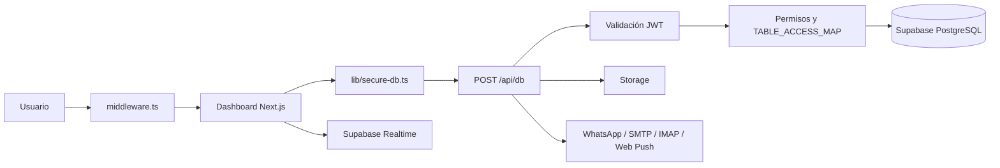

# iglesiamzi

Plataforma web y PWA para la gestión integral de iglesias. Centraliza
administración, membresía, asistencia, cronogramas, finanzas, formación,
acción social, comunicaciones y notificaciones en un dashboard protegido por
usuarios, módulos y permisos.

> **Estado:** sistema de uso operativo y en desarrollo activo. La disponibilidad
> de cada módulo depende de los permisos asignados al usuario y, en ciertos
> casos, de que exista un mes de trabajo activo.

> **¿Vas a instalarlo para otra iglesia?** Sigue la
> [Guía de Replicación](docs/REPLICACION.md): explica paso a paso cómo copiar el
> proyecto, crear Supabase, configurar el `.env` y personalizar el nombre, el
> logo y la marca **sin tocar el código**. El esquema de la base de datos está
> documentado en [`docs/ESQUEMA-BASE-DE-DATOS.md`](docs/ESQUEMA-BASE-DE-DATOS.md).

## Contenido

- [Funciones principales](#funciones-principales)
- [Tecnologías](#tecnologías)
- [Arquitectura](#arquitectura)
- [Seguridad y permisos](#seguridad-y-permisos)
- [Requisitos](#requisitos)
- [Instalación](#instalación)
- [Variables de entorno](#variables-de-entorno)
- [Base de datos y migraciones](#base-de-datos-y-migraciones)
- [Comunicaciones y tareas programadas](#comunicaciones-y-tareas-programadas)
- [Comandos disponibles](#comandos-disponibles)
- [Despliegue](#despliegue)
- [Estructura del repositorio](#estructura-del-repositorio)
- [Limitaciones conocidas](#limitaciones-conocidas)
- [Contribuciones](#contribuciones)
- [Licencia](#licencia)

## Funciones principales

### Administración y seguridad

- Usuarios, sesiones y perfiles.
- Permisos por módulo: visualización, edición y administración.
- Grupos y orden dinámico de módulos.
- Configuración administrativa y auditoría de actividad.
- Acceso condicionado por usuario, permiso y mes activo.

### Miembros y vida pastoral

- Censo general, MDG, jóvenes y niños.
- Cumpleaños, listados y archivos de miembros.
- Bautizos, matrimonios y presentación de niños.
- Discipulado por ciclos e historial de formación.
- Pastoral, Somos Uno y seguimiento ministerial.

### Asistencia, ministerios y cronogramas

- Asistencia general y de servidores.
- Controles específicos por ministerio.
- Cronogramas de servicio y eventos.
- Mensajes, citaciones y requerimientos.
- Gestión de células y seguimiento de atrasados.

### Finanzas

- Ingresos y egresos.
- Diezmos, alfolí y ofrendas de células.
- Caja chica y pagos diarios.
- Flujo de pagos y nómina.
- Presupuesto anual y resumen mensual.

### Formación, proyectos y acción social

- Herederos del Reino por grupos de edad.
- Proyecto Mario y sus cursos.
- Encuentros y eventos.
- Inventario.
- Redil y ayuda social.
- Consolidación y reporte de incidencias.

### Comunicaciones y documentos

- CRM de WhatsApp mediante la API oficial de Meta.
- Contactos, conversaciones, campañas y plantillas.
- Correo saliente SMTP y bandeja entrante IMAP.
- Notificaciones internas y Web Push.
- Generación de certificados y documentos PDF.
- Importación y exportación de hojas de cálculo XLSX.

Las funciones visibles no son iguales para todas las cuentas. El dashboard
consulta los módulos, grupos y permisos almacenados en la base de datos antes
de construir la navegación.

## Tecnologías

- **Aplicación:** Next.js 15 con App Router, React 19 y TypeScript.
- **Interfaz:** Tailwind CSS 4, Radix UI, Lucide, Sonner y Recharts.
- **Datos:** Supabase/PostgreSQL, Realtime y Storage.
- **Autenticación:** JWT con `jose` y contraseñas verificadas con `bcryptjs`.
- **PWA:** `next-pwa` y service worker personalizado.
- **Mensajería:** WhatsApp Cloud API de Meta.
- **Correo:** Nodemailer, ImapFlow y MailParser.
- **Push:** Web Push con claves VAPID.
- **Documentos:** PDF-Lib, Fontkit, Sharp y XLSX.
- **Producción:** VPS, PM2 y GitHub Actions por SSH.

## Arquitectura



### Flujo principal

1. `middleware.ts` protege las rutas `/dashboard/**` y valida la cookie de
   sesión.
2. El dashboard carga los módulos disponibles según los permisos del usuario.
3. Los componentes utilizan `lib/secure-db.ts` para serializar consultas.
4. `POST /api/db` verifica el JWT y aplica las reglas de
   `lib/module-table-map.ts`.
5. Solo después de autorizar la operación, el servidor accede a Supabase con la
   clave de servicio.
6. Realtime utiliza el cliente público y depende también de políticas RLS
   correctamente configuradas.

Los servicios de cada dominio se encuentran principalmente en `lib/mod/`. Las
integraciones que requieren secretos se ejecutan en rutas del servidor bajo
`app/api/`.

## Seguridad y permisos

La aplicación no utiliza Supabase Auth. Mantiene una autenticación propia:

- `POST /api/login` verifica usuario y contraseña, registra la sesión y emite un
  JWT con vigencia limitada.
- `middleware.ts` valida el token antes de permitir acceso al dashboard.
- Las API protegidas aceptan el JWT y las tareas internas utilizan secretos de
  servidor.
- `/api/db` bloquea de forma predeterminada las tablas que no estén registradas
  en el mapa de acceso.
- Las operaciones de escritura requieren permisos de edición o administración,
  según la tabla y la operación.
- La clave `SUPABASE_SERVICE_KEY` nunca debe exponerse al navegador ni usar un
  nombre con prefijo `NEXT_PUBLIC_`.

> **Importante:** el sistema trata datos personales y puede incluir información
> de menores. Deben aplicarse mínimos privilegios, HTTPS, respaldos, políticas
> RLS verificadas y las obligaciones legales de protección de datos aplicables.

## Requisitos

- Node.js y npm. Se recomienda **Node.js 20 LTS**; el repositorio todavía no
  fija una versión mediante `engines` o `.nvmrc`.
- Una instancia Supabase/PostgreSQL previamente provisionada.
- Acceso al SQL Editor y Storage de Supabase.
- Para producción: servidor Linux, PM2, proxy inverso, dominio y HTTPS.
- Para WhatsApp: cuenta de Meta for Developers y WhatsApp Cloud API.
- Para correo: cuentas SMTP e IMAP compatibles.

## Instalación

### 1. Clonar el repositorio

```bash
git clone https://github.com/derekkv/iglesiamzi.git
cd iglesiamzi
```

### 2. Instalar dependencias

```bash
npm ci
```

### 3. Configurar el entorno

Copia la plantilla versionada y complétala:

```bash
cp .env.example .env.local
```

Define las variables descritas en la sección [Variables de entorno](#variables-de-entorno).
No copies secretos reales a commits, issues, capturas ni pull requests.

Para **personalizar la identidad de la iglesia** (nombre, siglas, logo, colores)
sin tocar código, define las variables `NEXT_PUBLIC_CHURCH_*`. La guía completa
de replicación para otra iglesia está en
[`docs/REPLICACION.md`](docs/REPLICACION.md).

### 4. Preparar Supabase

La aplicación necesita una base inicializada. Empieza por `sql/schema.sql`
(esquema base consolidado) y luego aplica las migraciones incrementales. Revisa
[Base de datos y migraciones](#base-de-datos-y-migraciones) y la
[Guía de Replicación](docs/REPLICACION.md) antes de ejecutar cualquier SQL.

Configura también el bucket de Storage `redil-archivos` y sus políticas según
los módulos que manejarán adjuntos.

### 5. Iniciar el entorno de desarrollo

```bash
npm run dev
```

Abre [http://localhost:3001](http://localhost:3001).

## Variables de entorno

Existe una plantilla versionada y comentada en [`.env.example`](.env.example).
Cópiala a `.env.local` (desarrollo) o `.env` (producción) y completa los valores.

Utiliza valores distintos, largos y aleatorios para los secretos de producción.
Las variables con prefijo `NEXT_PUBLIC_` son visibles en el navegador (no pongas
secretos ahí).

```dotenv
# Supabase en el servidor
SUPABASE_URL=
SUPABASE_SERVICE_KEY=

# Supabase en el navegador
NEXT_PUBLIC_SUPABASE_URL=
NEXT_PUBLIC_SUPABASE_ANON_KEY=

# Sesiones y URL pública
JWT_SECRET=
NEXT_PUBLIC_SITE_URL=

# APIs internas y tareas programadas
INTERNAL_API_SECRET=
CRON_SECRET=

# Web Push
VAPID_PUBLIC_KEY=
VAPID_PRIVATE_KEY=

# SMTP: respaldo de la configuración almacenada en la base
SMTP_HOST=
SMTP_PORT=
SMTP_USER=
SMTP_PASS=

# IMAP: respaldo de la configuración almacenada en la base
IMAP_HOST=
IMAP_PORT=
IMAP_USER=
IMAP_PASS=

# Identidad de la iglesia (marca) — opcional, con valores por defecto
NEXT_PUBLIC_CHURCH_NAME=
NEXT_PUBLIC_CHURCH_SHORT_NAME=
NEXT_PUBLIC_CHURCH_INITIALS=
NEXT_PUBLIC_CHURCH_APP_TITLE=
NEXT_PUBLIC_CHURCH_DOMAIN=
NEXT_PUBLIC_CHURCH_CONTACT_EMAIL=
```

> A partir de esta versión, los clientes de Supabase (`lib/supabase.ts` y
> `lib/supabase-server.ts`) **no incluyen credenciales por defecto**: si faltan
> las variables, la app falla al arrancar con un mensaje claro. Esto evita que
> una instalación nueva use por error la base de datos de otra iglesia.

### Personalización de la marca

Toda la identidad visible (nombre, siglas, logo, color, correos, firma) se
centraliza en [`lib/branding.ts`](lib/branding.ts) y se controla con las
variables `NEXT_PUBLIC_CHURCH_*`. El manifiesto PWA se genera dinámicamente en
[`app/manifest.ts`](app/manifest.ts). Consulta el detalle en
[`docs/REPLICACION.md`](docs/REPLICACION.md) §6.

### Configuración fuera del entorno

Las credenciales de Meta, como `phone_number_id`, `waba_id`, `business_id`,
`access_token`, `app_secret` y `verify_token`, se administran desde el módulo de
comunicaciones y se almacenan en `wa_config`.

SMTP e IMAP se resuelven primero desde la configuración guardada en la base de
datos y luego desde las variables de entorno como respaldo.

> Si un secreto estuvo alguna vez dentro de `.env`, código fuente o historial
> Git, eliminarlo del archivo actual no es suficiente: debe rotarse y retirarse
> también del historial antes de hacer público el repositorio.

## Base de datos y migraciones

El sistema utiliza Supabase/PostgreSQL para usuarios, permisos, censos,
asistencia, cronogramas, finanzas, comunicaciones, inventario, eventos y los
demás dominios de la aplicación.

Empieza por el esquema base consolidado y luego aplica las migraciones
**incrementales** (pueden depender de tablas preexistentes). No ejecutes todos
los archivos indiscriminadamente en producción. Los principales son:

- **`sql/schema.sql`**: **esquema base consolidado** (usuarios, módulos,
  permisos, meses, censo, finanzas, asistencia, cronogramas, formación,
  inventario…). Ejecútalo **primero**.
- `sql/comunicaciones.sql`: WhatsApp, correo, campañas, plantillas y adjuntos.
- `sql/encuentro_participantes.sql`: participantes de encuentros.
- `sql/eventos_tabs.sql`: estructura adicional de eventos.
- `sql/resumen-mensual-migration.sql`: configuración del resumen mensual.
- `supabase-proyecto-mario.sql`: esquema de Proyecto Mario.
- `migracion-belleza-integral.sql`: evolución del módulo de belleza integral.
- `docs/caja-chica-migration.sql`: caja chica.
- `docs/manual-entries-migration.sql`: registros manuales.
- `docs/redil-ayuda-social-migration.sql`: ayuda social.
- `docs/RLS-POLICIES.sql`: políticas generales de acceso.

El orden de ejecución recomendado está en
[`docs/REPLICACION.md`](docs/REPLICACION.md) §7.

Antes de aplicar una migración:

1. Crea un respaldo de la base.
2. Revisa tablas y políticas que crea, altera o elimina.
3. Confirma sus dependencias y el orden correcto para tu instancia.
4. Prueba primero en un entorno separado.
5. Verifica `lib/module-table-map.ts` y las políticas RLS relacionadas.

Algunos scripts presuponen que ya existen tablas base como `users`,
`system_modules`, `module_groups` y `user_permissions`.

## Comunicaciones y tareas programadas

La guía detallada para WhatsApp Cloud API, SMTP e IMAP se encuentra en
[`docs/CONFIGURACION-WHATSAPP-EMAIL.md`](docs/CONFIGURACION-WHATSAPP-EMAIL.md).

### WhatsApp

- Webhook público: `/api/whatsapp/webhook`.
- Requiere HTTPS válido.
- Usa la API oficial de Meta.
- Los mensajes fuera de la ventana de atención de 24 horas requieren plantillas
  aprobadas.
- El webhook valida el token de verificación y puede validar la firma mediante
  el App Secret configurado.

### Correo

- Envío saliente mediante SMTP.
- Sincronización de bandeja mediante IMAP.
- Adjuntos almacenados en Supabase Storage.
- La sincronización automática debe programarse externamente en el servidor.

Ejemplo de sincronización cada cinco minutos:

```cron
*/5 * * * * curl -s -X POST https://<DOMINIO>/api/email/sync -H "X-Internal-Secret: <INTERNAL_API_SECRET>" > /dev/null 2>&1
```

Los endpoints `/api/cron-reminders` y `/api/cron-cumpleanos` también requieren
un programador externo. Sus horarios deben definirse según la operación de cada
iglesia y no están versionados en este repositorio.

### PWA y notificaciones

La PWA está desactivada durante desarrollo y se habilita en las compilaciones
de producción. El worker personalizado en `worker/index.js` recibe eventos push,
muestra notificaciones y dirige al usuario al dashboard.

## Comandos disponibles

| Comando | Descripción |
| --- | --- |
| `npm run dev` | Inicia Next.js con Turbopack en el puerto `3001`. |
| `npm run lint` | Ejecuta el análisis estático configurado por el proyecto. |
| `npm run build` | Genera la compilación de producción. |
| `npm run start` | Sirve la compilación en el puerto `3712`. |
| `npm run deploy` | Compila y ejecuta `pm2 reload iglesia`. |

No existe actualmente un script de pruebas automatizadas.

## Despliegue

El workflow `.github/workflows/deploy.yml` despliega automáticamente cada push
a `main` en un VPS mediante SSH. El servidor esperado debe contar con:

- repositorio en `/var/www/iglesiamzi`;
- Node.js y npm;
- variables de entorno de producción;
- PM2 y un proceso previamente creado con el nombre `iglesia`;
- proxy inverso y certificado HTTPS; y
- tareas cron configuradas fuera del repositorio.

El workflow instala con `npm ci`, compila y recarga PM2. Los secretos del
repositorio de GitHub requeridos son:

- `HOST`
- `USERNAME`
- `SSH_KEY`
- `PORT`

`npm run deploy` no crea por sí mismo el proceso PM2, el proxy, TLS, DNS ni las
tareas programadas.

## Estructura del repositorio

```text
app/                    App Router, páginas y API routes
app/dashboard/          Módulos funcionales protegidos
app/api/                Auth, BD, archivos, cron, correo, push y WhatsApp
components/             Componentes reutilizables y UI
contexts/               Contextos React y sesión de usuario
hooks/                  Hooks de permisos, Realtime y UI
lib/                    Auth, Supabase, autorización y utilidades
lib/mod/                Servicios de dominio por módulo
sql/                    Esquemas y migraciones SQL incrementales
scripts/                Utilidades administrativas puntuales
docs/                   Guías operativas y migraciones adicionales
public/                 Manifest, iconos, plantillas y recursos
worker/                 Service worker personalizado de la PWA
types/                  Declaraciones TypeScript
.github/workflows/       Despliegue automático al VPS
```

## Limitaciones conocidas

- `sql/schema.sql` reconstruye el esquema base a partir del uso en el código;
  dos tablas sin uso observable (`service_notifications_log`,
  `inventory_movements`) traen una estructura mínima marcada `[INFERIDO]`.
- El catálogo completo de módulos/grupos se administra desde el panel, no viene
  sembrado por completo.
- La versión de Node.js aún no está fijada en el repositorio (se recomienda 20 LTS).
- La configuración inicial de PM2 y del proxy inverso no está versionada.
- Los horarios de cron se administran externamente.
- No existe una suite de pruebas automatizadas configurada.
- Las políticas RLS y el mapa de tablas deben revisarse al añadir módulos.

## Contribuciones

Consulta [`CONTRIBUTING.md`](CONTRIBUTING.md) antes de enviar cambios.

Resumen del proceso:

1. Trabaja en una rama dedicada.
2. No incluyas secretos ni datos personales reales.
3. Mantén cada cambio enfocado y documenta migraciones o configuración nueva.
4. Ejecuta al menos lint y build cuando corresponda.
5. Firma tus commits con la certificación de origen:

```bash
git commit -s -m "Descripción clara del cambio"
```

6. Envía un pull request explicando el problema, la solución, la validación y el
   impacto sobre permisos o datos.

Las vulnerabilidades y credenciales expuestas no deben publicarse en issues.
Utiliza el contacto privado indicado en `CONTRIBUTING.md`.

## Licencia

Copyright © 2026 **SALAS ORTIZ JAIME VICENTE**.

Este proyecto se distribuye bajo la
[Licencia Comunitaria de Software para Iglesias — Ecuador, versión 1.0](LICENSE).
Es una licencia personalizada de código fuente disponible que permite usar,
estudiar, modificar y compartir el sistema para beneficio de entidades
religiosas autorizadas.

**No se permite vender el Software, cobrar por su licencia o explotarlo como un
SaaS comercial.** Sí pueden cobrarse servicios profesionales independientes,
como instalación, adaptación, soporte o alojamiento dedicado, conforme a las
condiciones completas de `LICENSE`.

Esta licencia no es una licencia de código abierto reconocida por la OSI ni una
licencia de software libre reconocida por la FSF. Consulta también
[`NOTICE`](NOTICE) para información de titularidad y componentes de terceros.
